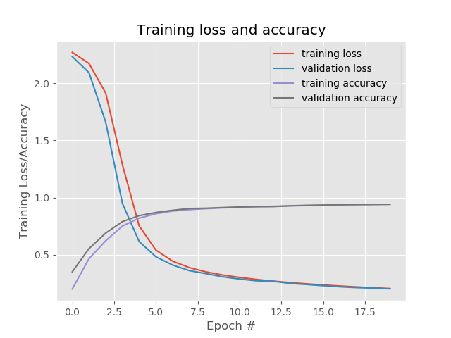

The LeNet architecture is a seminal work in the deep learning community, 
first introduced by LeCun et al. in their 1998 paper, Gradient-Based learning 
applied to Document Recognition. The motivation behind the paper was for 
Optical Character Recognition (OCR). 

Thee objective is to replicate experiments similar to LeCun's in their 1998 paper.
Start by reviewing the LeNet architecture and then implement the network using 
Keras. Finally evaluate LeNet on MNIST dataset for handwritten digit recognition. 

## LeNet Architecture 

The LeNet architecture consists of two series of CCONV => TANH => POOL layers 
sets followed by a fully-connected layer and softmax output. 

| Layer Type     | Output Size  | Filter Size/Stride |
| :------------- | :----------: | ----------------:  |
|  INPUT IMAGE   | 28×28×1      |                    |
| CONV           | 28×28×20     | 5x5, k=20          |
| ACT            | 28×28×20     |                    |
| POOL           | 14×14×20     | 2x2                |
| CONV           | 14×14×50     | 5x5, k=50          |
| ACT            | 14x14×50     |                    |
| POOL           | 7x7x50       | 2x2                |
| FC             | 500          |                    |
| ACT            | 500          |                    |
| FC             | 10           |                    |
| SOFTMAX        | 10           |                    |

The network is small and easy to understand - yet large enough to provide 
interesting results. Furthermore, the combination of LeNet + MNIST is able to 
easily run on the CPU making it easy for any one to run it on their local machine. 

INPUT => CONV => TANH => CONV => TANH => POOL => FC => TANH => FC 
Instead of tanh we will use ReLu as our activation function. 

### Implementing LeNet
```project Structuree
|--- lenet_mnist.py
|--- utilities 
|   |--- __init__.py 
|   |--- datasets 
|   |   |--- __init__.py 
|   |   |--- simpleedataseetloader.py 
|   |--- preprocessing 
|   |   |--- __init__.py 
|   |   |--- imagetoarraypreprocessor.py 
|   |   |--- simplepreprocessor.py 
|   |--- nn
|   |   |--- __init__.py
|   |   |--- conv
|   |   |   |--- __init__.py
|   |   |   |--- shallownet.py
|   |   |   |--- lenet.py
```
### LeNet on MNIST 
``` Results when running the shallowNet with lr=0.001
Epoch 20/20
52500/52500 [==============================] - 53s 1ms/step - loss: 0.2043 - acc: 0.9409 - val_loss: 0.2017 - val_acc: 0.9412
[INFO] evaluating the network...
              precision    recall  f1-score   support

           0       0.97      0.96      0.97      1677
           1       0.97      0.98      0.97      1935
           2       0.95      0.94      0.94      1767
           3       0.93      0.93      0.93      1766
           4       0.96      0.91      0.94      1691
           5       0.93      0.93      0.93      1653
           6       0.96      0.96      0.96      1754
           7       0.94      0.94      0.94      1846
           8       0.92      0.92      0.92      1702
           9       0.87      0.93      0.90      1709

   micro avg       0.94      0.94      0.94     17500
   macro avg       0.94      0.94      0.94     17500
weighted avg       0.94      0.94      0.94     17500

```


