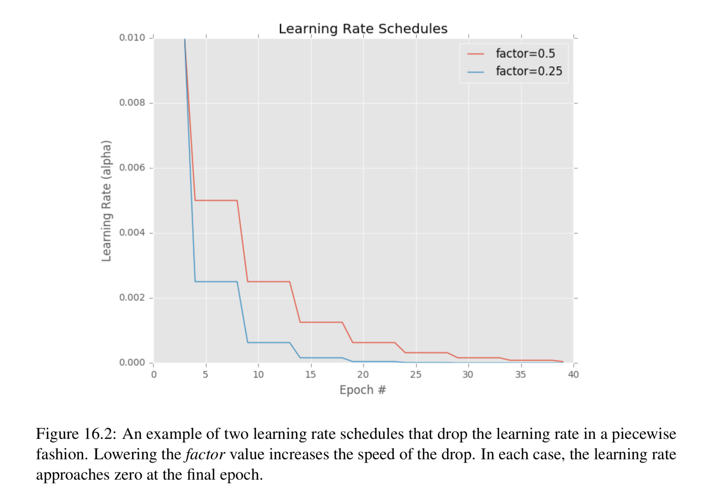
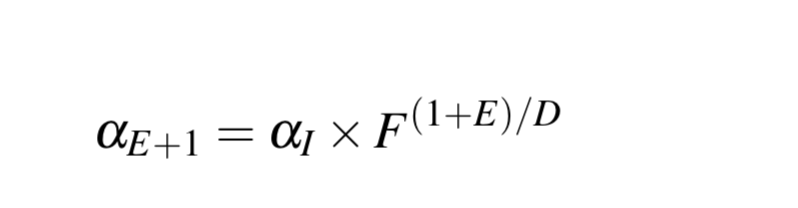

Concept of learning rate schedules (also known as learning rate annealing or 
adaptive learning rates). By adjusting our learning rates on an epoch-to-epoch basis, 
we can reduce loss and increase accuracy, and even in certain situations 
reduce the total amount of time it takes to train the network. 

## Droping the learning rate 
The most simple and heavily learning rates are the ones that progressively reduce 
learning rate over time.  
Standard weight update formula  
W += -argss["alpha"]*gradient 

Learning rate $\alpha$ controls the step we make along the gradient. 
In all previous examples the learning rate was constant and then trained the 
network for a fixed number of epochs without changing the learning rate. This 
method may work in some situations, but its always beneficial to decrease the 
learning rate over time. 

When training our network we are trying to find some location along our loss 
landscape where the network obtains reasonable accuracy. It dosen't have to be a 
global minimum or even a local minima, but in practice, simply finding the area of the 
loss landscape with reasonable low loss is "good enough". 

Decreasing our learning rate, therby allowing our network to take smaller steps - 
this decreased rate enables our network to descend into areas of loss landscape that 
are "more optimal" and would have otherwise been missed entirely by large learning rate.  

Process of Learning rate Scheduling:  
* Finding a set of reasonably good weights in the training process 
with a higher learning rate. 
* Tuning these weights later in the process to find more optimal weights using a 
smaller learning rate. 

Two primary type of learning rate schedulers that one might encounter: 
* Learning rate scheduler that decrease gradually based on epoch number (like a 
linear, polynomial or an exponential function).
* Learning rate schedulers that drop based on specific epoch (such as piecewise function).  
The goal is to review both types of learning rates 

### Standard Decay Schedule in Keras 
The keras library ships with a time based learning rate scheduler - it is 
controlled via the decay parameter of the optimizer classes (such as SGD). 

### Step-based Decay 
* Systematically drop the learning rate after specific epochs during training. 
* Also known as piece wise functions, 
 

Two options when applying step decay to our learning rate 
1. Define an equation that models the piece wise drop in learning rate that we 
want to achieve. 
2. Use (ctrl + c) method to training the deep learning network where we train 
for some number of epochs at a given learning rate, eventually notice validation performance 
has stalled, then (ctrl + c) to stop our script, adjust our learning rate and continue 
training. 

### Implimenting custom learning rate schedules in keras 
Keras library provides us with a LearningRateScheduler class that allows us to 
define a custom learning rate function and then have it automatically applied 
during training process. This function should take epoch number as argument and then 
compute the desired learning rate based on a function that we define. 

A piece wise function that will drop the learning rate by a certain factor F after 
every D epochs. 
  
where 
* alphaI is our initial learning rate,
* F is the factor value controlling the rate in which the learning rate drops  
* D is the "drop every" epoch value 
* E is the current epoch 
The larger our factor F is the slower our learning will decay. 
Conversley the smaller the factor F is the faster the learning rate 

---------------------------------------------------------------------------------
---------------------------------------------------------------------------------
alpha = iniAlpha * (factor**np.floor((1+epoch)/dropEvery))
---------------------------------------------------------------------------------
---------------------------------------------------------------------------------

