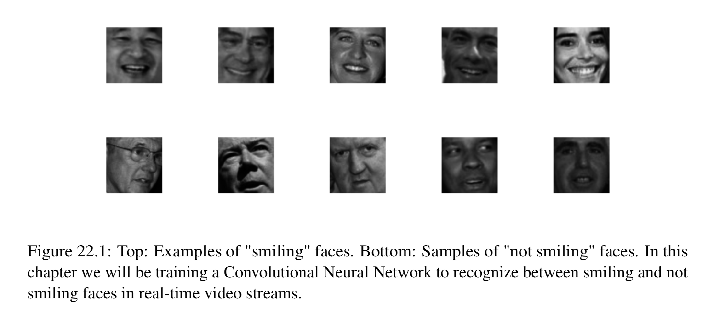
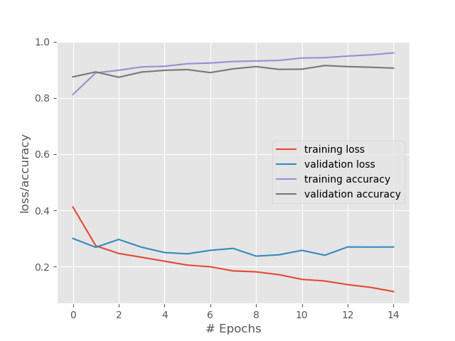

# Smile Detection 
Goal is to build a complete end to end application that can detect smiles in a video stream 
in real time using deep learning along with traditional computer vision techniques.  
To accomplish this we will train LeNet architecture on a dataset of images that contain faces 
of people that are smiling and not smiling. Once the network is trained we will create a 
separate python script - this one will detect faces in images via OpenCV's built-in 
**Haar Cascade face detector**, extract the face ROI (region of interest) from the image and 
then pass the ROI through LeNet for smile detection. 

## The Smiles Dataset 
The Smiles dataset consists of images that are either smiling or not smiling. 
In total there are 13165 grayscaled images in the dataset, with each image having a size of 
64x64 pixels.  
The images in this dataset are tightly cropped around the face, which will make thee training 
process easier as we will be able to train smiling or not smiling patterns directly from the 
input images.
  
However the close cropping posses a problem during testing - since our input images will not 
only contain a face but the background of the image as well, we first need to localize the 
face in the image and extract the face ROI before we can pass it through our network for 
detection. Luckily using traditional computer vision methods such as Haar Cascades, 
this is much easier task than it sounds.  
The second issue we need to handel in the smiles dataset is class imbalance. While there are 
13165 images in the dataset 9475 of these are not smiling while only 3960 belong to the 
smiling class. Given that there are over 2.5x the number of `non smiling` images to 
`smiling` example, we need to be careeful while devising our training process. 
Our network may naturally pick the `not smiling` label since 
1) The distributions are uneven 
2) It has more examples of what a non smiling face looks like  
We can combat class imbalance by computing a weight for each class during training time. 

### Training the Smile CNN 
Epoch 1/15  
2019-09-27 16:45:53.407983: I tensorflow/core/platform/cpu_feature_guard.cc:141] Your CPU supports instructions that this TensorFlow binary was not compiled to use: AVX2 FMA  
10532/10532 [==============================] - 12s 1ms/step - loss: 0.4118 - acc: 0.8118 - val_loss: 0.2998 - val_acc: 0.8747  
Epoch 2/15  
10532/10532 [==============================] - 11s 1ms/step - loss: 0.2737 - acc: 0.8889 - val_loss: 0.2683 - val_acc: 0.8921  
Epoch 3/15  
10532/10532 [==============================] - 11s 1ms/step - loss: 0.2465 - acc: 0.8981 - val_loss: 0.2964 - val_acc: 0.8731  
Epoch 4/15  
10532/10532 [==============================] - 11s 1ms/step - loss: 0.2329 - acc: 0.9102 - val_loss: 0.2688 - val_acc: 0.8918  
Epoch 5/15  
10532/10532 [==============================] - 11s 1ms/step - loss: 0.2189 - acc: 0.9124 - val_loss: 0.2498 - val_acc: 0.8978  
Epoch 6/15  
10532/10532 [==============================] - 11s 1ms/step - loss: 0.2050 - acc: 0.9214 - val_loss: 0.2452 - val_acc: 0.9005  
Epoch 7/15  
10532/10532 [==============================] - 10s 976us/step - loss: 0.1992 - acc: 0.9239 - val_loss: 0.2576 - val_acc: 0.8899  
Epoch 8/15  
10532/10532 [==============================] - 10s 990us/step - loss: 0.1844 - acc: 0.9294 - val_loss: 0.2644 - val_acc: 0.9032  
Epoch 9/15  
10532/10532 [==============================] - 10s 980us/step - loss: 0.1812 - acc: 0.9311 - val_loss: 0.2370 - val_acc: 0.9111  
Epoch 10/15  
10532/10532 [==============================] - 10s 971us/step - loss: 0.1710 - acc: 0.9332 - val_loss: 0.2417 - val_acc: 0.9013  
Epoch 11/15  
10532/10532 [==============================] - 10s 961us/step - loss: 0.1544 - acc: 0.9417 - val_loss: 0.2576 - val_acc: 0.9020  
Epoch 12/15  
10532/10532 [==============================] - 10s 958us/step - loss: 0.1486 - acc: 0.9429 - val_loss: 0.2401 - val_acc: 0.9149  
Epoch 13/15  
10532/10532 [==============================] - 10s 968us/step - loss: 0.1357 - acc: 0.9485 - val_loss: 0.2696 - val_acc: 0.9111  
Epoch 14/15  
10532/10532 [==============================] - 10s 974us/step - loss: 0.1259 - acc: 0.9529 - val_loss: 0.2692 - val_acc: 0.9088  
Epoch 15/15  
10532/10532 [==============================] - 10s 988us/step - loss: 0.1110 - acc: 0.9600 - val_loss: 0.2695 - val_acc: 0.9058  

Past 15 epochs we can see that our network is approaching roughly 90% classification accuracy.  
Past six epochs our validation loss starts to stagnate. Further training past epoch 15 would 
result in over-fitting. Wee can improve the accuracy of our Smile detector by using more 
training data, either by:
1) Gathering additional training data 
2) Applying data augmentation to randomly translate, rotate, and shift our existing training set. 

### Running the SMILE CNN on Realtime

