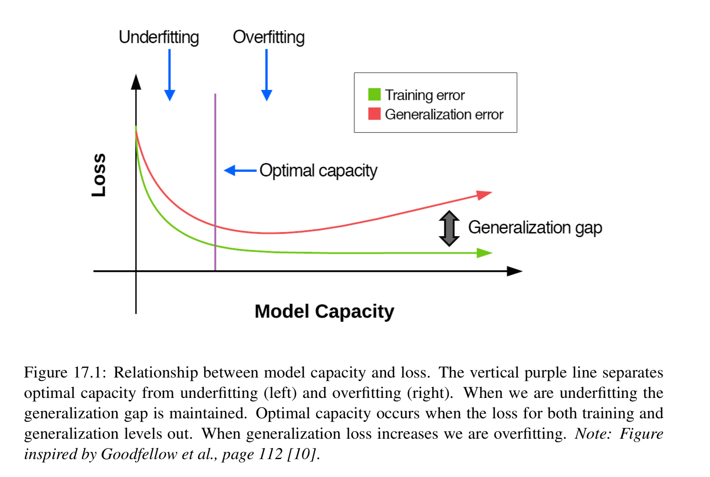
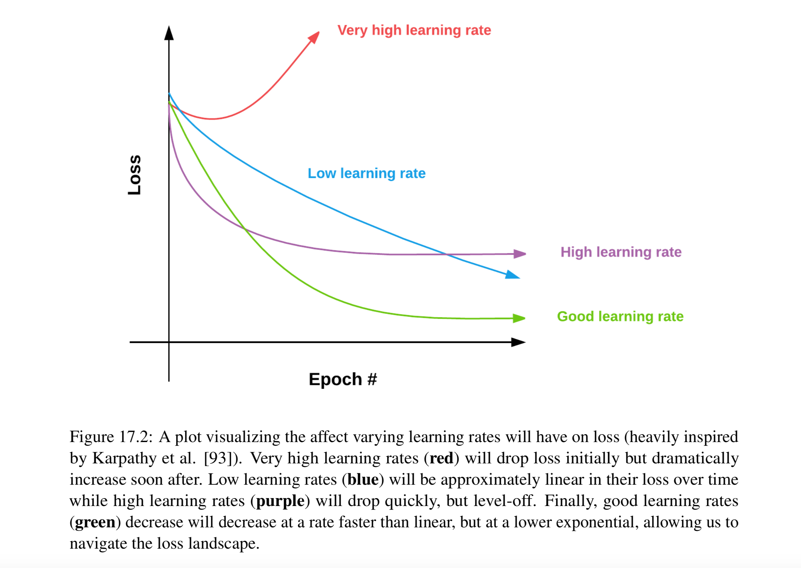

Discuss how to create a near realtime monitor for Keras that can be used to babysit 
the training process of the network. Waiting until the end of the training process to 
visualize loss and accuracy can be computationaly wasteful, especially if our 
experiments take a long and we have no way to visualize loss accuracy during the 
training process itself (other than looking at raw terminal output). 
Instead it would be benifical if we could plot the training and loss after every epoch 
and visualize the result. 

Goal here is to:
1. Reduce the training loss as much as possible 
2. While ensuring the gap between training and testing loss is reasonably small 

Controlling weather the model is going to overfit or under fit can be accomplished 
by adjusting the capacity of the network. 
* we can increase capacity by adding more layers and neurons to our network. 
* we can decrease capacity by removing layers and neurons and applying 
regularization techniques (weight decay, dropout, data augmentation early stopping)  


How do we combat overfitting?
Two techniques: 
1. Reduce the complexity of a model opting for a more shallow network and neurons
2. Apply regularization methods 

### Effects of learning rates
 
 
### Creating a training Monitor 
* Create a TrainingMonitor callback 
* Call the TrainingMonitor callback at the end of every network when training a 
network with keras 

```project Structuree
|--- lenet_mnist.py
|--- utilities 
|   |--- __init__.py 
|   |--- datasets 
|   |   |--- __init__.py 
|   |   |--- simpleedataseetloader.py 
|   |--- preprocessing 
|   |   |--- __init__.py 
|   |   |--- imagetoarraypreprocessor.py 
|   |   |--- simplepreprocessor.py 
|   |--- nn
|   |   |--- __init__.py
|   |   |--- conv
|   |   |   |--- __init__.py
|   |   |   |--- shallownet.py
|   |   |   |--- lenet.py
|   |--- callbacks
|   |   |--- __init__.py 
|   |   |--- trainingmonitor.py
```

